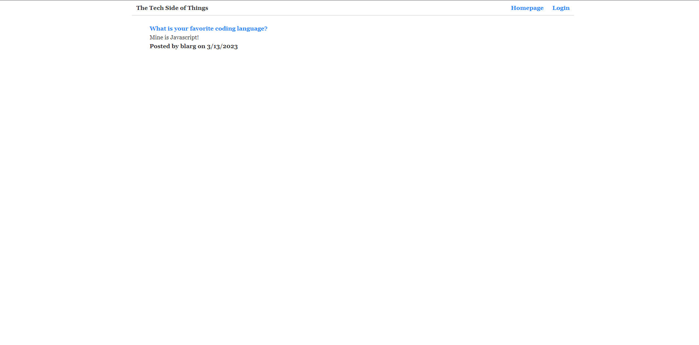

# Tech-blog

## Table of Contents

- [Description](#description)
- [Installation](#installation)
- [Screenshot](#screenshot)
- [Video](#video)
- [Usage](#usage)
- [Licenses](#license)
- [Questions](#questions)
- [Credits](#credits)

## Description

This is a Tech-blog using the MVC sturcture, using Handlebars.js to render different pages. This blog allows users to post and comment on different users posts about tech. Sequelize and express-session are used for authentication.

## Installation

In order to install follow these steps.

- In order to use this app you must have Node.js, Express.js, Sequelize, Mysql2, connection-session/express-session.
- When you have those appilcations installed, start by cloning the repository.
- Now that the repository is cloned to your local machine run `npm install`
- next start mysql `mysql -u root -p` and enter your password. source the schema.sql.
- run `npm start` in your terminal and open your browser to view http://localhost3001

## Screenshot

## Deployed

Deployed on Heroku! :

## Usage

This app allows users to become a member by signing up. When they become a member they are allowed to view their dashboard of posts. The use then can add, edit, and delete blog posts or comment on other users posts!

## Licenses

This project is covered under the MIT license. click the license button at the top to learn more.

https://opensource.org/licenses/MIT

## Questions

Questions regarding this project?
GitHub: https://github.com/Ryebread5555
Email: rypetty55@gmail.com
